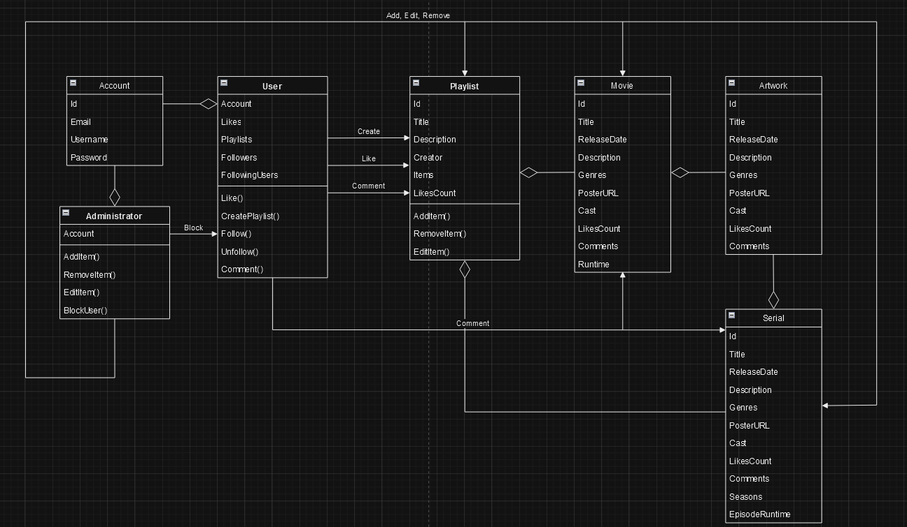

<h1 align="center">f.geek</h1> 
<h2 align="center">“Веб-приложение для поиска фильмов / сериалов”</h2>

<h4>Пользователи имеют личные аккаунты, где они могут сохранять фильмы или сериалы, которые они хотят посмотреть, а также возможность оценки произведения при помощи лайка. Также будет возможность оставить комментарий к фильму / сериалу.</h4>

<h4>На основе количества лайков на фильме будет создаваться некоторый рейтинг, из которого пользователи смогут искать фильмы на их вкус. Будет возможность выбора фильмов определенного жанра или страны-производителя фильма.</h4> 

<h4>Будет возможность просмотра профилей других пользователей, подписки на их обновления</h4>

<h4>В самом приложении будет возможность просмотра информации о фильме, смотреть трейлеры.</h4>

<h4>Для пользователей будут создаваться подборки произведений, на основе их лайков. Также будут подборки для всех пользователей, исключительно по жанрам, или по каким-либо другим критериям.</h4>

<h3>Сущности:</h3>

<h4>class Account:</h4>

    Id - уникальный идентификатор аккаунта
    Email - почта на которую зарегестрирован аккаунт
    Username - имя пользователя
    Password - пароль аккунта

<h4>class User:</h4>

    Account - аккаунт пользователя
    Likes - коллекция понравившихся фильмов / сериалов / плейлистов
    Playlists - плейлисты пользователя
    Followers - коллекция подписчиков пользователя
    Following - коллекция подписок пользователя

    Like() - лайкнуть фильм / сериал / плейлист
    CreatePlaylist() - создать плейлист
    Follow() - подписаться на пользователя
    Unfollow() - отписаться от пользователя
    Comment() - оставить комментарий на фильме / сериале / плейлисте

<h4>class Administrator:</h4>

    Account - аккаунт админа

    AddItem() - добавить фильм / сериал / плейлист
    RemoveItem() - удалить фильм / сериал / плейлист
    EditItem() - редактировать фильм / сериал / плейлист

<h4>class Artwork:</h4>

    Id - уникальный идентификатор произведения
    Title - название произведения
    ReleaseDate - дата выхода произведения
    Description - описание произведения
    Genres - коллекция жанров произведения
    PosterURL - ссылка на постер к произведению
    Cast - коллекция актеров произведения
    LikesCount - количество лайков
    Comments - коллекция комментариев

<h4>class Movie:</h4>

    Id - уникальный идентификатор произведения
    Title - название произведения
    ReleaseDate - дата выхода произведения
    Description - описание произведения
    Genres - коллекция жанров произведения
    PosterURL - ссылка на постер к произведению
    Cast - коллекция актеров произведения
    LikesCount - количество лайков
    Comments - коллекция комментариев
    Runtime - длительность фильма

<h4>class Episode:</h4>

    Id - уникальный идентификатор эпизода
    Title - название эпизода
    LikesCount - количество лайков
    Comments - коллекция комментариев

<h4>class Serial:</h4>

    Id - уникальный идентификатор произведения
    Title - название произведения
    ReleaseDate - дата выхода произведения
    Description - описание произведения
    Genres - коллекция жанров произведения
    PosterURL - ссылка на постер к произведению
    Cast - коллекция актеров произведения
    LikesCount - количество лайков
    Comments - коллекция комментариев
    Seasons - количество сезонов
    Episodes - коллекция эпизодов
    EpisodeRuntime - длительность одного эпизода

<h4>class Playlist:</h4>

    Id - уникальный идентификатор плейлиста
    Title - название плейлиста
    Description - описание к плейлисту
    Creator - создатель плейлиста
    Items - коллекция произведений, добавленных в плейлист
    LikesCount - количество лайков плейлиста

    AddItem() - добавить произведение в плейлист
    RemoveItem() - удалить произведение из плейлиста

<h3 align="center">Class Diagram</h3> 

    

